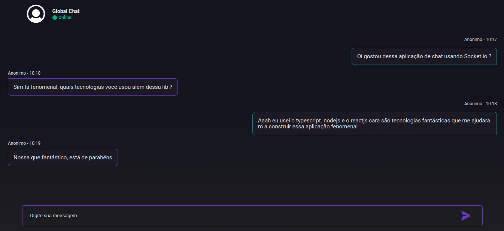

# Chat Message

This is an application that I built to present as the final work of the SerMais institute course promoted by Accenture.

## Table of contents

- [Overview](#overview)
  - [The challenge](#the-challenge)
  - [Screenshot](#screenshot)
- [My process](#my-process)
  - [Built with](#built-with)
- [Author](#author)

## Overview

### The challenge

Users must be able to:

- See the ideal layout for each page depending on your device's screen size
- See hover states for all interactive elements on the page
- Interact by sending messages and receiving messages

### Screenshot

## My process

### Built with

- Semantic HTML5 markup;
- CSS custom properties;
- Clean Code;
- Flexbox;
- Mobile-first workflow;
- Web responsive design;
- ReactJS;
- NodeJs;
- Typescript;
- Socket.io

## Author

- Pedro Cardoso da Silva
- Github - [@Eu-Pedro0ficial](https://github.com/Eu-Pedro0ficial)
- Instagram - [ohpedro0ficial](https://instagram.com/ohpedro0ficial?igshid=ZDdkNTZiNTM=)
- Arthur santos
- Github - [@fx987](https://github.com/fx987)
